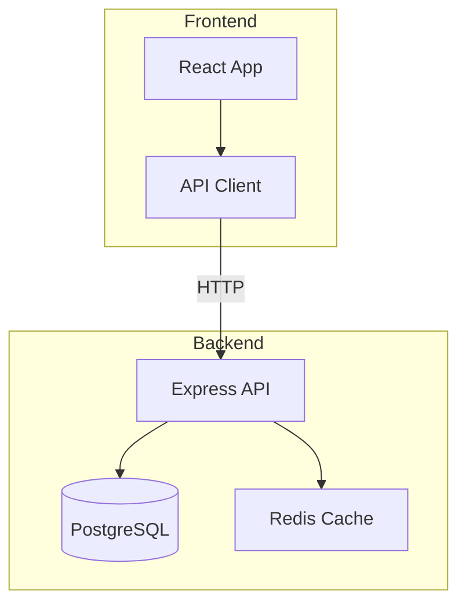

# Diagram Generator

从自然语言描述生成架构图、流程图、时序图，支持 Mermaid 和 Excalidraw 格式。

## Overview

根据用户描述自动生成可渲染的图表文件。优先使用 Mermaid（语法简洁、渲染广泛），复杂布局用 Excalidraw。生成后自动验证语法正确性。

## When to Use

- 用户想画架构图、流程图、时序图
- 用户提到 diagram、flowchart、architecture、ER diagram
- 用户想可视化系统设计、数据流、API 调用链
- 用户输入 `/diagram-generator`

**When NOT to Use:**
- 用户只是想看代码结构（用 AST 分析）
- 用户想要 UI 原型/线框图（那是另一个领域）
- 用户想要编辑已有图表（提供原始文件即可）

## Core Pattern

### Step 1: 确定图表类型

| 用户描述关键词 | 推荐图表类型 | Mermaid 语法 |
|--------------|-------------|-------------|
| 架构、组件、部署 | 架构图 | `graph TB` |
| 流程、步骤、判断 | 流程图 | `flowchart TD` |
| 调用、请求、响应 | 时序图 | `sequenceDiagram` |
| 表、关系、外键 | ER 图 | `erDiagram` |
| 状态、生命周期 | 状态图 | `stateDiagram-v2` |
| 类、继承、实现 | 类图 | `classDiagram` |
| 甘特图、排期 | 甘特图 | `gantt` |

### Step 2: 收集信息

```bash
# 如果是项目架构图，先扫描项目结构
ls -la
find . -name "*.ts" -o -name "*.go" -o -name "*.py" | head -20
cat package.json 2>/dev/null | python3 -c "import sys,json; d=json.load(sys.stdin); print(list(d.get('dependencies',{}).keys())[:10])" 2>/dev/null
```

提取：
- 项目类型和技术栈
- 模块/服务划分
- 数据流向
- 外部依赖

### Step 3: 生成图表

**方案 A: Mermaid（推荐）**

生成 `.mmd` 文件，可直接在 GitHub/Notion/Typora 渲染：



**方案 B: Excalidraw**

生成 `.excalidraw` JSON 文件，适合需要自定义布局的复杂架构图：

```json
{
  "type": "excalidraw",
  "version": 2,
  "elements": [...]
}
```

### Step 4: 验证

```bash
# Mermaid 语法检查
npx @mermaid-js/mermaid-cli@latest mmdc -i diagram.mmd -o /dev/null 2>&1 || echo "语法错误"
```

## Quick Reference

```bash
/diagram-generator                         # 交互式询问图表类型
/diagram-generator --type flowchart        # 指定类型
/diagram-generator --format mermaid        # 指定格式（默认 mermaid）
/diagram-generator --format excalidraw     # Excalidraw 格式
/diagram-generator --output ./docs/        # 指定输出目录
```

| 参数 | 说明 | 默认值 |
|------|------|--------|
| `--type` | 图表类型（flowchart/sequence/er/state/class/gantt） | 自动检测 |
| `--format` | 输出格式 mermaid / excalidraw | mermaid |
| `--output` | 输出目录 | `./` |
| `--render` | 生成后自动渲染为 PNG | false |

## Mermaid 速查

```mermaid
# 流程图
flowchart TD
    A[开始] --> B{条件判断}
    B -->|是| C[执行]
    B -->|否| D[跳过]

# 时序图
sequenceDiagram
    Client->>API: POST /users
    API->>DB: INSERT INTO users
    DB-->>API: OK
    API-->>Client: 201 Created

# ER 图
erDiagram
    USER ||--o{ ORDER : places
    ORDER ||--|{ ORDER_ITEM : contains
    PRODUCT ||--o{ ORDER_ITEM : "is in"

# 状态图
stateDiagram-v2
    [*] --> Idle
    Idle --> Processing : submit
    Processing --> Done : complete
    Processing --> Failed : error
    Done --> [*]
```

## Common Mistakes

| 错误 | 正确做法 | 原因 |
|------|----------|------|
| 所有东西都用 Excalidraw | 简单图用 Mermaid | Mermaid 更轻量、渲染更广 |
| 图表塞太多节点 | 拆分为多个子图 | 单图超过 15 个节点难读 |
| 不加标题/图例 | 加 subgraph 和注释 | 读者不知道图在说什么 |
| 箭头没有标签 | 给关键箭头加文字 | 关系不明确 |
| 颜色太花哨 | 用 3-4 个主色 | 颜色太多没有重点 |
