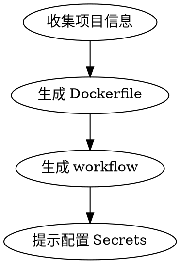

# Docker Build & Deploy

一键生成完整的 Docker 构建 + 推送 + 部署 GitHub Actions 工作流。

## When to Use

- 用户要把项目容器化并部署
- 用户需要 GitHub Actions 自动构建 Docker 镜像
- 用户提到 Docker、GHCR、容器部署、CI/CD
- 用户输入 `/docker-build-deploy`

**When NOT to Use:**
- 用户只是想写 Dockerfile
- 用户用 Kubernetes 部署（流程不同）
- 用户不用 GitHub Actions

## 执行流程



### Step 1: 收集信息

交互式询问以下信息（有默认值）：

| 参数 | 说明 | 默认值 |
|------|------|--------|
| `registry` | 容器仓库 | `ghcr.io` |
| `port` | 容器对外端口 | `3000` |
| `env_file` | 服务器上的 env 文件路径 | 空（不使用） |
| `deploy_host` | 部署服务器地址 | 从 GitHub Secrets 读取 |
| `needs_dockerfile` | 是否需要生成 Dockerfile | 自动检测 |

**智能检测逻辑：**
- 已有 Dockerfile → 跳过生成，只生成 workflow
- 有 `package.json` → Node.js 项目，生成对应 Dockerfile
- 有 `go.mod` → Go 项目
- 有 `requirements.txt` 或 `pyproject.toml` → Python 项目
- 都没有 → 询问用户项目类型

### Step 2: 生成 Dockerfile（如需要）

根据项目类型生成优化的 Dockerfile：
- 多阶段构建（build + production）
- 利用缓存层（先复制依赖文件，再复制源码）
- 非 root 用户运行
- 健康检查

### Step 3: 生成 Workflow

从模板 `templates/docker-deploy.yml` 生成工作流，替换以下变量：

| 变量 | 说明 |
|------|------|
| `{{IMAGE_NAME}}` | 镜像名（ghcr.io/{owner}/{repo}） |
| `{{PORT}}` | 容器端口 |
| `{{ENV_FILE}}` | env 文件路径 |
| `{{CONTAINER_NAME}}` | 容器名（默认 repo 名） |

输出到 `.github/workflows/docker-deploy.yml`。

### Step 4: 提示配置 Secrets

告知用户需要在 GitHub repo Settings → Secrets 中配置：
- `DEPLOY_HOST` — 服务器 IP
- `DEPLOY_USER` — SSH 用户名
- `DEPLOY_PASSWORD` — SSH 密码或密钥

## Quick Reference

```bash
# 生成完整工作流（交互式）
/docker-build-deploy

# 直接指定端口
/docker-build-deploy --port 8080

# 指定端口 + env 文件
/docker-build-deploy --port 8080 --env-file /opt/app/.env
```

## Common Mistakes

| 错误 | 正确做法 | 原因 |
|------|----------|------|
| 用 `latest` 单 tag | 同时打 `latest` + `${{ github.sha }}` | 方便回滚 |
| 不设置 `packages: write` 权限 | 在 job 中声明 `permissions: packages: write` | GHCR 推送需要 |
| deploy 步骤不检查容器是否存在 | 先 `docker stop` + `docker rm` 再 `docker run` | 避免端口冲突 |
| 不清理旧镜像 | 部署后 `docker image prune -f` | 磁盘空间 |
| env 文件硬编码在 workflow 中 | 通过 Secrets 或变量传入 | 安全性 |
