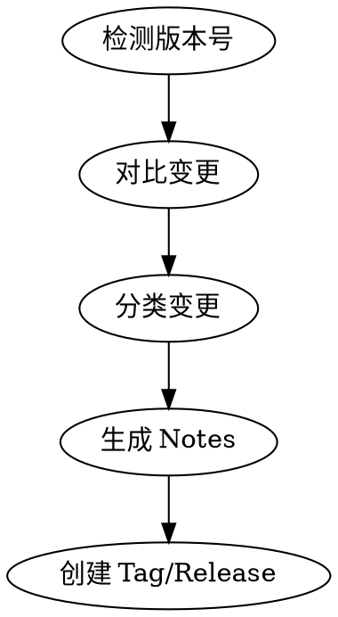

# Release Notes Generator

打 tag 时自动对比代码变更，生成标准化的 Release Notes。

## When to Use

- 用户要打 tag / 创建 release
- 用户想总结版本变更
- 用户提到 changelog、release notes、版本说明
- 用户输入 `/release-notes`

**When NOT to Use:**
- 用户只是想看 git log
- 用户想修改已有的 release notes

## 执行流程



### Step 1: 检测版本号

```bash
# 获取最新 tag
git describe --tags --abbrev=0 2>/dev/null || echo "v0.0.0"

# 获取所有 tag，排序
git tag --sort=-v:refname | head -5
```

- 如果用户指定了版本号（如 `v1.1.0`），直接使用
- 如果没有，根据变更类型建议版本号：
  - 有 breaking changes → major（v2.0.0）
  - 有新功能 → minor（v1.1.0）
  - 只有 bugfix → patch（v1.0.1）

### Step 2: 对比变更

```bash
# 获取上一个 tag
PREV_TAG=$(git describe --tags --abbrev=0 2>/dev/null)

# 对比内容
git log ${PREV_TAG}..HEAD --oneline
git diff ${PREV_TAG}..HEAD --stat
git diff ${PREV_TAG}..HEAD
```

分析维度：
- **Commit 消息**：分类 feat / fix / chore / docs / refactor
- **文件变更**：新增、修改、删除
- **影响范围**：哪些模块/目录被改动

### Step 3: 分类变更

将变更分为以下类别：

| 类别 | 前缀 | 说明 |
|------|------|------|
| 🚀 Features | `feat:` | 新功能 |
| 🐛 Bug Fixes | `fix:` | 修复 |
| 📝 Documentation | `docs:` | 文档 |
| ♻️ Refactor | `refactor:` | 重构 |
| 🔧 Chores | `chore:` | 构建/工具/配置 |
| 💥 Breaking Changes | `BREAKING CHANGE` | 破坏性变更 |
| 📦 Other | 其他 | 未分类 |

**智能分类：**
- 读取 commit 消息中的 conventional commit 前缀
- 没有前缀的 commit，根据文件变更内容推断类别
- 检测 `BREAKING CHANGE` 或 `!` 标记

### Step 4: 生成 Notes

使用模板 `templates/release-notes.md` 生成，包含：
- 版本号和日期
- 变更摘要（一句话总结）
- 按类别分组的变更列表
- 新贡献者（如有）
- 完整 diff 链接

### Step 5: 创建 Tag 和 Release（可选）

```bash
# 创建 annotated tag
git tag -a ${VERSION} -m "${RELEASE_NOTES}"

# 推送 tag
git push origin ${VERSION}

# 创建 GitHub Release（需要 gh CLI）
gh release create ${VERSION} --notes "${RELEASE_NOTES}"
```

询问用户：
1. 是否创建 tag？
2. 是否创建 GitHub Release？
3. 是否作为 draft？

## Quick Reference

```bash
# 交互式生成（检测上一个 tag，建议版本号）
/release-notes

# 指定版本号
/release-notes v1.1.0

# 只生成 notes，不创建 tag
/release-notes --dry-run
```

### 参数

| 参数 | 说明 | 默认值 |
|------|------|--------|
| `version` | 版本号 | 自动建议 |
| `--dry-run` | 只生成不创建 | false |

## 输出示例

```markdown
## v1.1.0 (2026-06-03)

### 🚀 Features
- 新增 docker-build-deploy skill，支持一键生成 Docker CI/CD 工作流
- 新增 release-notes-generator skill

### 🐛 Bug Fixes
- 修复 GitHub Action YAML 语法错误（heredoc 改 printf）
- 修复 build-index job 权限不足问题

### 📝 Documentation
- 重写 README：根目录简洁介绍，每个 skill 文件夹详细说明
- 补充 npx skills 安装方式

### 🔧 Chores
- gitignore 添加 .playwright-mcp/ 和 .agents/
- 更新 skills.sh 发现索引

**Full Changelog**: https://github.com/owner/repo/compare/v1.0.0...v1.1.0
```

## Common Mistakes

| 错误 | 正确做法 | 原因 |
|------|----------|------|
| 只看 commit 数量 | 分析实际代码变更 | commit 数量不代表变更规模 |
| 忽略 breaking changes | 重点标注 💥 | 用户需要知道不兼容变更 |
| 不分类，全部列在一起 | 按 feat/fix/docs 分组 | 可读性差 |
| notes 太长 | 精简为关键变更 + diff 链接 | 用户不需要看每个细节 |
